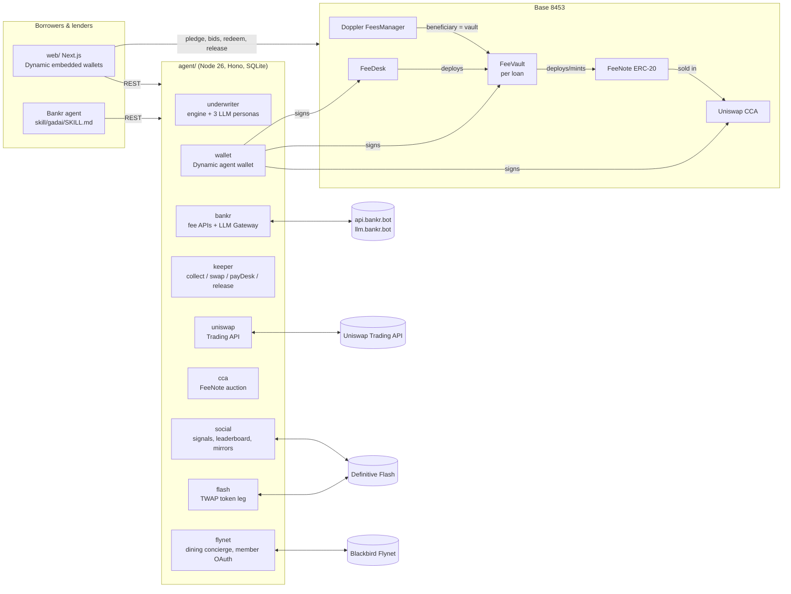
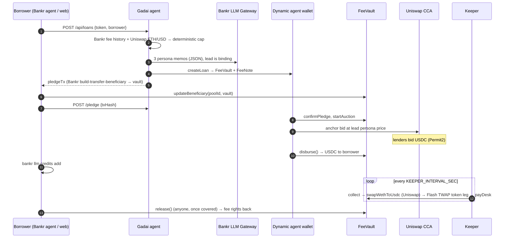

# Gadai

**Gadai lends USDC to Bankr agents and creators against their token's creator-fee stream, and holds that stream as an on-chain lien the desk can't keep.**

Built for Runtime Agent Week (Bankr x Propaganda). Chain: Base (8453).

A Bankr token launched through Doppler pays its creator a share of every trade. Many agents need cash now (LLM credits, x402 APIs, inventory) and have steady fees coming in later. Bankr's guidance for an agent whose fees don't cover its compute is to cut operations or top up by hand. Before Gadai, nothing on Bankr let a creator borrow against those future fees. Gadai does, using a primitive Doppler already ships: `updateBeneficiary(poolId, newBeneficiary)`.

1. **Underwrite.** The desk's agent reads the token's real fee history from the Bankr API. A deterministic engine sets the maximum it can lend. Three underwriter personas, each on a different model through the **Bankr LLM Gateway**, write credit memos. The lead persona's decision is binding. An LLM can only decline a loan or lower the amount, never raise it.
2. **Pledge.** The borrower moves its fee beneficiary share to a per-loan **FeeVault** contract. It can do this from a Dynamic embedded wallet in the web app, through Bankr chat, or with its own Bankr agent via our **Bankr Skill**.
3. **Fund.** The loan becomes a new ERC-20, the **FeeNote**, whose face value is the debt. FeeNotes are sold for USDC in a **Uniswap Continuous Clearing Auction**. The desk's **Dynamic agent wallet** places an anchor bid at its own underwriter's price, and lenders bid alongside it. When the auction graduates, the same agent wallet sends the USDC to the borrower. The borrower can turn it straight into LLM credits with `bankr llm credits add`.
4. **Service.** The keeper collects fees into the vault. WETH is swapped to USDC through the **Uniswap Trading API**, with the vault itself as the swapper. The creator-token leg is sold via a **Definitive Flash TWAP**, with the vault as an EIP-1271 funder, so the borrower's own token isn't dumped. USDC building up in the vault is the repayment, and noteholders redeem 1:1.
5. **Release.** Once the notes are covered, **anyone** can call `release()`. The vault gives the fee rights back to the borrower and forwards any surplus. The borrower never depends on the desk to get its fees back.

Two more things run on the same loan:
- **Follow the Desk.** Every credit decision is a public, scored signal. Underwriter personas are ranked on a leaderboard by realized repayment and follower PnL. Followers can mirror approved borrowers' tokens as a Flash market entry with an attached **Bracket** (take-profit and stop-loss), or as a DCA built from a long Flash TWAP.
- **Dine on your fees.** Every loan carries a dining budget (its `drawLimit`). A concierge plans a meal inside it from live **Blackbird Flynet** data: venues, hours, specials and challenges, plus the member's own check-ins after a Blackbird login. Our Flynet app is read-only, so Gadai moves no money for dining: the member pays in the Blackbird app.

> Nothing in this repo is mocked. A missing key makes the process throw `Missing env X (see .env.example)`. The one demo mode, `DEMO_FORK=1`, runs on an Anvil fork of Base and every web page labels it.

---

## Architecture





**Trust model.**
- The lien is enforced by the contract. Only `release()` and `cancel()` can move the fee share, and both move it back to the borrower.
- The keeper (the Dynamic agent wallet) can relay swap calldata, but the vault approves only the exact amount and enforces `minUsdcOut` on-chain.
- It can authorize Flash orders only when the swapper and recipient are the vault itself, the output is USDC, and the input is WETH or the creator token.
- Two assumptions remain, and we state them openly:
  - Flash enforces slippage off-chain, because the signed Flash order has no min-out.
  - The desk chooses when to sell.

---

## Sponsor tracks: where each integration lives

Line ranges are generated from symbol names by [`docs/anchors.mjs`](docs/anchors.mjs); `node docs/anchors.mjs` fails if any range is stale.

### Bankr: grand prize
Bankr is the product's foundation, not a plug-in. The collateral, the underwriting data, the credit decision, the borrower channel and the use of the funds all run on Bankr.

**Fee APIs drive the underwriting.**
- [`agent/src/bankr/index.ts#L73-L129`](agent/src/bankr/index.ts#L73-L129): `/token-launches/{token}/fees`, `creator-fees`, `claimable-fees`, `build-transfer-beneficiary` and `build-claim`, plus `llmChat` against `llm.bankr.bot/v1/chat/completions`.
- [`agent/src/underwriter/index.ts#L31-L79`](agent/src/underwriter/index.ts#L31-L79): `quote()` hard-rejects anything that isn't a Base Doppler token. It uses the API `share` and the unclaimed fees at pledge time, which follow the vault and count as the first repayment.
- [`agent/src/underwriter/engine.ts#L46-L115`](agent/src/underwriter/engine.ts#L46-L115): the decay-aware rate (the minimum of the 7-day, 30-day and lifetime rates, with a slope haircut), the lumpiness-priced fee, and the tick-aligned floor.

**The LLM Gateway makes the credit decision.**
- [`agent/src/underwriter/index.ts#L13-L17`](agent/src/underwriter/index.ts#L13-L17): three personas on three Gateway models.
- [`#L81-L161`](agent/src/underwriter/index.ts#L81-L161): each persona's memo and the binding lead decision.
- [`engine.ts#L121-L141`](agent/src/underwriter/engine.ts#L121-L141): `parseMemo` fails closed. If the model tries to exceed the cap or returns a bad price, the result is a parse failure, which returns 502 and creates no loan.

**The pledge is Bankr's own primitive.**
- [`agent/src/server/index.ts#L110-L187`](agent/src/server/index.ts#L110-L187): `apply` accepts only a borrower-signed `applyMessage` (EIP-191, single-use nonce), then builds `pledgeTx` via `build-transfer-beneficiary` with `newBeneficiary = FeeVault` and checks it byte-for-byte.
- [`#L229-L288`](agent/src/server/index.ts#L229-L288): verifies the pledge on-chain with `getShares` (authoritative) and cross-checks Bankr's `claimable-fees` for the vault.

**Enforceable lien.**
- [`contracts/src/FeeVault.sol#L248-L256`](contracts/src/FeeVault.sol#L248-L256): `confirmPledge`.
- [`#L445-L454`](contracts/src/FeeVault.sol#L445-L454): `release`, which is permissionless.
- [`#L483-L491`](contracts/src/FeeVault.sol#L483-L491): `_returnLien`, which calls `updateBeneficiary(poolId, borrower)`.

**Bankr Skill.** Any Bankr agent can borrow by chat:
- [`skill/gadai/SKILL.md`](skill/gadai/SKILL.md) and [`skill/gadai/catalog.json`](skill/gadai/catalog.json) use the `<slug>/SKILL.md + catalog.json` layout of `BankrBot/skills`.
- The skill walks through quote → apply → pledge via `/wallet/submit` or the documented chat phrase → status → `bankr llm credits add` → early repay → release, and it puts every write behind explicit user confirmation.

**The loan becomes LLM credits.** See step 6 of the skill, plus the `disbursed` event on the loan page.

The dining concierge asks the Bankr LLM to order its verified Flynet shortlist ([`agent/src/flynet/index.ts#L495-L509`](agent/src/flynet/index.ts#L495-L509)); with no credits it says so and uses its deterministic ranker.

### Dynamic: an agent that decides, then pays

**Agent wallet** (Node SDK, agent signing token pattern):
- [`agent/src/wallet/index.ts#L42-L89`](agent/src/wallet/index.ts#L42-L89): SIWE sign-in with the agent signing token, then `authenticateJwt` and the `DynamicEvmWalletClient` MPC wallet.
- [`#L202-L248`](agent/src/wallet/index.ts#L202-L248): `getAgentWallet`, the viem client that every desk transaction goes through.
- [`agent/src/wallet/bootstrap.ts`](agent/src/wallet/bootstrap.ts): the one-time identity and key-share bootstrap.

**Decision → payment.** Right after the lead memo approves, the same wallet signs:
- `createLoan`: [`agent/src/keeper/index.ts#L23-L44`](agent/src/keeper/index.ts#L23-L44)
- the USDC anchor bid in the note auction: [`agent/src/cca/index.ts#L129-L204`](agent/src/cca/index.ts#L129-L204)
- `disburse()`, which sends USDC to the borrower: [`agent/src/cca/index.ts#L317-L352`](agent/src/cca/index.ts#L317-L352), backed by [`FeeVault.sol#L297-L312`](contracts/src/FeeVault.sol#L297-L312)

Before that decision, the same wallet pays a third-party API over x402 for a token risk verdict and uses the answer (see [Desk buys a risk verdict over x402](#desk-buys-a-risk-verdict-over-x402-dynamic-agent-payment)).

After that, it signs every keeper transaction ([`keeper/index.ts#L102-L237`](agent/src/keeper/index.ts#L102-L237)).

**Embedded wallets** (React SDK):
- [`web/lib/wallet.tsx#L11-L80`](web/lib/wallet.tsx#L11-L80): `DynamicContextProvider` + `EthereumWalletConnectors`, and `useSigner`, which sends the transactions.
- Borrowers sign the pledge in [`web/components/pledge.tsx#L12-L88`](web/components/pledge.tsx#L12-L88).
- Lenders sign Permit2 approvals and `submitBid` in [`web/components/auction.tsx#L10-L149`](web/components/auction.tsx#L10-L149).

**Delegated access** (auto-mirroring for Follow the Desk):
- [`agent/src/social/delegation.ts#L16-L95`](agent/src/social/delegation.ts#L16-L95): verifies the webhook HMAC, stores the encrypted share, and signs with `delegatedSignTypedData` / `delegatedSignTransaction`.
- [`agent/src/social/index.ts#L346-L361`](agent/src/social/index.ts#L346-L361): the auto executor.
- [`web/app/desk/page.tsx#L202-L283`](web/app/desk/page.tsx#L202-L283): the follow form, which asks for delegation with `useWalletDelegation`.

### Uniswap: New Assets, New Agents

**A new on-chain asset.** A FeeNote is an ERC-20 claim on one loan's repayment stream.
- [`contracts/src/FeeNote.sol`](contracts/src/FeeNote.sol): the token itself.
- [`contracts/src/FeeDesk.sol#L52-L72`](contracts/src/FeeDesk.sol#L52-L72): `createLoan` deploys a vault and a note for every loan.
- [`FeeVault.sol#L436-L441`](contracts/src/FeeVault.sol#L436-L441): holders redeem notes 1:1 for USDC.

**The CCA funds the loan.**
- [`contracts/src/FeeVault.sol#L259-L293`](contracts/src/FeeVault.sol#L259-L293): `startAuction` calls the v2.1.0 factory `create`, with `requiredCurrencyRaised = principal`, mints exactly the face value to the auction, then calls `onTokensReceived`.
- [`agent/src/cca/index.ts#L33-L38`](agent/src/cca/index.ts#L33-L38): step packing with `encodePacked(uint24 mps, uint40 blocks)`.
- [`#L129-L204`](agent/src/cca/index.ts#L129-L204): launch plus the agent's anchor bid.
- [`#L241-L272`](agent/src/cca/index.ts#L241-L272): bid plans, with the `prevTickPrice` hint computed by walking `ticks()`.
- [`#L275-L309`](agent/src/cca/index.ts#L275-L309): exit and partial-exit hints from walking the checkpoints.
- [`#L317-L352`](agent/src/cca/index.ts#L317-L352): settles with `checkpoint()` before reading `isGraduated()`.

**Agents price the notes.** Each underwriter persona publishes a `maxNotePrice`. The desk agent bids at the lead's price, and the auction panel has a "copy this agent's bid" button for human lenders ([`web/components/auction.tsx#L10-L149`](web/components/auction.tsx#L10-L149)).

**Trading API** (`/check_approval` → `/quote` → `/swap`, no-Permit2 SwapProxy flow, contract swapper):
- [`agent/src/uniswap/index.ts#L13-L22`](agent/src/uniswap/index.ts#L13-L22): headers, including `x-permit2-disabled`, `x-universal-router-version` and `x-agent-info` with `decision_origin: autonomous`.
- [`#L120-L145`](agent/src/uniswap/index.ts#L120-L145): `buildVaultSwap`.
- [`#L87-L94`](agent/src/uniswap/index.ts#L87-L94): the calldata guards.
- [`#L107-L116`](agent/src/uniswap/index.ts#L107-L116): ETH/USD for underwriting.
- On-chain execution: [`contracts/src/FeeVault.sol#L357-L378`](contracts/src/FeeVault.sol#L357-L378) (`swapWethToUsdc`: exact approve, SwapProxy call, `minUsdcOut`).
- The keeper call: [`agent/src/keeper/index.ts#L164-L187`](agent/src/keeper/index.ts#L164-L187).

**Developer feedback:** [`FEEDBACK.md`](FEEDBACK.md).

### Definitive Flash: Best Social Trading Build (@DefinitiveFi)

**TWAP.** The keeper sells the creator-token fee leg so it doesn't dump the borrower's token.
- [`agent/src/flash/index.ts#L84-L162`](agent/src/flash/index.ts#L84-L162): quote with `orderType:"twap"`, 12 or 24 buckets depending on price impact, and `funderAddress = vault`. It then calls `vault.authorizeFlashOrder` (checking the digest against viem's `hashTypedData`) and posts `/order`.
- [`#L165-L184`](agent/src/flash/index.ts#L165-L184): polls for fills.
- On-chain side: [`contracts/src/FeeVault.sol#L203-L233`](contracts/src/FeeVault.sol#L203-L233) (EIP-1271 `isValidSignature`, the Flash EIP-712 domain) and [`#L388-L405`](contracts/src/FeeVault.sol#L388-L405) (`authorizeFlashOrder` / `authorizeFlashCancel`).

**Follow the Desk** (social):
- [`agent/src/social/index.ts#L56-L89`](agent/src/social/index.ts#L56-L89): every persona memo becomes a public signal, and each follower gets a queued mirror.
- [`#L94-L131`](agent/src/social/index.ts#L94-L131) + [`score.ts#L39-L57`](agent/src/social/score.ts#L39-L57): the leaderboard, scored only on realized on-chain repayment and follower PnL from Flash fills. A persona with no realized data gets no score.
- [`#L265-L302`](agent/src/social/index.ts#L265-L302): the mirror quote. It is either a **market entry with an attached Bracket** (TP/SL) or a **DCA (Flash TWAP)** that buys one slice per day.
- [`#L305-L343`](agent/src/social/index.ts#L305-L343): submits the follower-signed entry and bracket.
- [`web/app/desk/page.tsx#L26-L157`](web/app/desk/page.tsx#L26-L157): the leaderboard, signal feed, follow form and the "my mirrors" queue, where followers sign.
- The auto mode runs through Dynamic delegation, as described above.

### Blackbird Flynet: dine on your fees
A dining concierge for borrowers and their agents. Ask "somewhere in NYC for four, open late, burgers" on `/dine/<loanId>` (or `POST /api/loans/:id/dine/plan`) and get a shortlist of real Blackbird venues with reasons, today's hours, a price-level cost estimate against the loan's dining budget, specials, challenges, and reserve/map/website links.
- [`agent/src/flynet/index.ts#L58-L110`](agent/src/flynet/index.ts#L58-L110): the live catalog. All ~1,675 Blackbird locations (`GET /locations`, 34 pages, fetched sequentially) are cached for 6 h in memory and in SQLite. Hours are cached for 6 h and specials/challenges for 1 h. If Flynet fails, the last good copy is served and labelled stale. We use locations rather than `/restaurants` because many restaurant rows have empty names and no venue data.
- [`#L179-L263`](agent/src/flynet/index.ts#L179-L263): the request parser (city, neighborhood, cuisine, late, price, reservations, "somewhere new") and the catalog pre-ranker (one venue per brand, budget fit, distance when the browser shares its location).
- [`#L434-L492`](agent/src/flynet/index.ts#L434-L492): the plan. Live open hours for the top 12, then specials and challenges for the top 6, in small batches because Flynet rate-limits bursts (429 is retried once). Missing hours, failed reads and over-budget picks become notes; the result never hides them.
- [`#L495-L509`](agent/src/flynet/index.ts#L495-L509): the Bankr LLM orders the shortlist and writes one sentence per pick using only the given facts. With no credits the plan is labelled `deterministic`.
- [`#L274-L363`](agent/src/flynet/index.ts#L274-L363): member context through OAuth 2.0 + PKCE. The borrower signs `flynetLinkMessage` to bind the login to the loan. The server exchanges the code with `client_secret` and refreshes single-use tokens (one refresh per loan at a time). Then it reads the profile, status tier, wallets/FLY balance and check-ins. That "passport" shows places visited and gaps nearby (venues in the member's neighborhoods they have not tried), and it personalizes the plan. It is gated on `FLYNET_CLIENT_SECRET`: without it the UI says "member login needs the app secret".
- [`#L527-L591`](agent/src/flynet/index.ts#L527-L591): routes. `GET /api/flynet/status`, `GET /api/flynet/restaurants?query&region&cuisine&price&page&loanId`, `GET /api/flynet/restaurants/:id`, `GET /api/loans/:id/dine`, `POST /api/loans/:id/dine/plan {request, partySize, time?, near?}`, `GET /api/loans/:id/dine/passport` and `DELETE /api/loans/:id/dine/member` (member session header), `GET /api/flynet/connect` and `/callback`. Bad input returns 400.
- **Payments are off, on purpose.** Our production app "hackathon" has `read:*` scopes only: no `write:rewards` and no payment intents. So the old FLY draw (`vault.addDraw` + `issue_reward`) and settle are removed. Booking on-chain debt with nothing disbursed would not be truthful. `FeeVault.addDraw` stays in the contract, unused. The UI shows "payment requires Blackbird partner access", and the member pays at the table in the Blackbird app.
- Tests use real production responses captured on 2026-09-19 (`agent/src/flynet/fixtures/`).

### Credit Line Board
`GET /api/board` ([`agent/src/board/index.ts`](agent/src/board/index.ts), page [`web/app/board/page.tsx`](web/app/board/page.tsx)) gives every Bankr agent with a Base token a live, pre-approved credit limit. For each profile from `GET https://api.bankr.bot/agent-profiles?sort=marketCap&limit=100` (offsets 0 and 100), the agent fetches `GET /token-launches/{token}/fees?days=30` and `GET /agent-profiles/{slug}/llm-usage?days=30`. It runs the same deterministic engine as a real quote (`computeTerms`, the lead underwriter's advance rate, `DESK_MAX_LOAN_USDC`, ETH/USD from a Uniswap Trading API quote) to get the max principal, fee rate and floor price. When the engine rejects an agent, its row says `not eligible: <reason>`.
- Response: `{ generatedAt, ethUsd, totals: { agents, eligible, totalCreditUsdc, lifetimeFeesWeth, claimableWeth, llmTokens30d, failed, nonBase, robinhoodAgents, indicativeCreditUsdc, equityAgents, equityFeesUsd, indicativeEquityCreditUsdc }, rows: [...], robinhood: [...] }`.
- **Onchain equities (Robinhood Chain).** Every non-Base profile today is on Robinhood Chain (17 of 121 on 2026-09-19), and some of those pools are quoted in Robinhood tokenized stocks, so the creator's fees arrive as shares: EARN in SPY, TESLR in TSLA, MINR in MSTR, SHOPKR in AMZN. The board prices them with the same engine and lead persona, in quote units:
  - Bankr's fee API labels every amount `weth`, but for a stock-quoted pool those numbers are WETH-equivalents. For EARN, 31.747529 SPY claimed maps to `totals.claimedWeth` 9.1845, and 1.755627 SPY claimable maps to 0.507898, which is 0.2893 WETH/SPY both times. Dividing by that ratio from the same response turns the series back into shares. The quote token's ticker and `kind: "stock"` come from `GET /token-launches/quote-tokens?chain=robinhood`.
  - Price: a Uniswap Trading API `/quote` for 0.1 share → Robinhood Chain WETH on chain 4663 (Universal Router 2.1.1, the chain's default), multiplied by the Base ETH/USD quote. A 1-share quote returned `NoRouteFoundError` on 2026-09-19 while 0.1 routed. On 2026-09-19: SPY 0.28902 WETH ≈ $763, TSLA 0.13790 ≈ $365, MSTR 0.05962 ≈ $158, AMZN ≈ $254 (DexScreener showed $762.92 for the SPY/WETH v3 pool). A failed quote becomes a row `error`.
  - Status: `eligible: false`, `maxLoanUsdc: 0`, and `indicativeUsdc` = the engine's max principal, with reason `indicative: desk contracts are deployed on Base; this line is priced but not yet lendable`. The fee rights are the same Doppler pattern. On Robinhood Chain (`https://robinhood-rpc.publicnode.com`), EARN's initializer `0x4e3468951D49f2EEa976eD0D6e75fFCb44a9a544` and the rehype fees manager `0x9982538f41f2ae29ddb9d3d9307010052984fdbb` both have the `collectFees` / `updateBeneficiary` / `getShares` / `getCumulatedFees0` selectors that FeeVault uses on Base, and `getShares(EARN pool, beneficiary)` returns `0.95e18`, matching the API's 95%. What is missing is Gadai's side: FeeDesk, FeeVault and FeeNote are deployed only on Base, and the vault only sells WETH → USDC against Chainlink ETH/USD. Lending here would need the desk deployed on 4663 and a stock → USDG liquidation path.
  - Live on 2026-09-19: 4 equity-fee agents, $65,552 of lifetime equity fees (beneficiary share), and $250 of indicative equity credit (EARN hits the $250 cap at 0.1524 SPY/day ≈ $116/day). The other three show `fee rate is 0` because they had no recent claims. Across all 17 Robinhood agents, including WETH-quoted ones, indicative credit is $536.40. `/board` has an "Onchain equities" section with a stock-only filter.
- The agent makes 6 requests at a time, each with a 15 s timeout, and keeps results in memory for 10 minutes. If a fetch fails, the row stays on the board with an `error` and is counted in `totals.failed`.
- This is a pre-approval, not a binding quote. On-chain checks (an open vault on the pool, the claimable-fees beneficiary check) and the LLM memos run when the agent applies. Each row's Apply button opens `/apply?token=…&borrower=…`.
- Tests: `agent/src/board/board.test.ts`, which runs on real API responses captured on 2026-09-19 (`agent/src/board/fixtures-captured-2026-09-19/`), including the Robinhood fee responses, `quote-tokens-robinhood.json`, and the Uniswap quotes (`uniswap-quote-4663-{SPY,TSLA,MSTR}-weth.json`, `uniswap-quote-8453-weth-usdc.json`).

### Paid credit report on Bankr x402 Cloud
`gadai-credit` is the Gadai engine sold as a paid API: **$0.02 USDC on Base per call**, no desk server needed.
- URL: `GET https://x402.bankr.bot/0x0455408228f460722ecbe80789bcf1628b479e98/gadai-credit?token=<0x…>[&borrower=<0x…>]`. Without payment it answers `402` with the x402 v2 payment requirements (`exact`, USDC `0x8335…2913`, amount `20000`).
- Call it: `bankr x402 call "https://x402.bankr.bot/0x0455408228f460722ecbe80789bcf1628b479e98/gadai-credit?token=0x5F980Dcfc4c0fa3911554cf5ab288ed0eb13DBa3"`. Schema: `bankr x402 schema <url>`.
- Handler: [`x402/gadai-credit/index.ts`](x402/gadai-credit/index.ts), config: [`bankr.x402.json`](bankr.x402.json). It reads `GET https://api.bankr.bot/public/doppler/token-fees/{token}?days=30` and ETH/USD from Coinbase spot (CoinGecko fallback), builds the same inputs as the board row, and runs a verbatim copy of `computeTerms` and its helpers from `agent/src/underwriter/engine.ts` (lead persona: 30% advance, $250 cap). x402 Cloud bundles one self-contained file, so the engine is copied, not imported; the header names the source commit.
- Response: `{ token, symbol, beneficiary, sharePct, history { days, lifetimeWeth, claimableWeth, r7, r30, rLife, slope30d, cv30d }, ethUsd, ethUsdSource, terms { maxPrincipalUsdc, feeRatePct, floorPrice, termDays, drawLimitUsdc }, eligible, reasons[], formula, generatedAt, source }`.
- A bad `token`/`borrower` address returns `400` and an upstream failure `502`, so no payment settles. A token Bankr never launched (e.g. WETH) is still a valid report: `200` with `eligible: false` and a reason.
- Like the board, this is a pre-approval (no on-chain reads). The on-chain checks run when you apply.
- Check: `node x402/check.ts` calls the handler on live data and asserts its terms equal `buildRow()` for the same fees and ETH price (GITLAWB, Surplus, Ratspeak, WETH, bad input). Redeploy: `npx -y @bankr/cli@latest x402 deploy gadai-credit`.

### Desk buys a risk verdict over x402 (Dynamic agent payment)
Before the desk approves a loan, its Dynamic agent wallet **pays a third-party API, retries the request and uses the response**: it buys a honeypot/rug verdict for the collateral token from a service on Bankr x402 Cloud, `POST https://x402.bankr.bot/0xf31f59e7b8b58555f7871f71973a394c8f1bffe5/honeypot-check` with `{"token":"0x…"}`, for **$0.05 USDC on Base**.
- **Flow.** The unpaid request gets `402` with an x402 v2 `PAYMENT-REQUIRED` header: `exact`, `eip155:8453`, USDC `0x8335…2913`, `amount 50000`, `payTo 0x8AEE…01a0`, EIP-712 domain `USD Coin` / `2`, facilitator `https://api.bankr.bot/facilitator`. The agent signs an EIP-3009 `transferWithAuthorization` with the Dynamic MPC wallet's `signTypedData` (no gas; the facilitator settles), retries with `PAYMENT-SIGNATURE`, reads the verdict, and takes the settlement tx from the `PAYMENT-RESPONSE` header.
- **Code.** [`agent/src/risk/index.ts`](agent/src/risk/index.ts) uses the documented x402 v2 client (`@x402/fetch` `wrapFetchWithPaymentFromConfig` + `@x402/evm` `ExactEvmScheme`, v2.26.0, as in Dynamic's x402 recipe). The signer is the desk `AgentWallet`, so the signature goes through the same serial queue and Dynamic re-auth as every desk transaction. A payment policy only signs `exact` / Base mainnet / native USDC with its mainnet domain / at most $0.05; anything else is refused before signing.
- **This is the one mainnet action.** The payment is real USDC on Base mainnet, also in `DEMO_FORK` (where every other write hits the Anvil fork). The typed data carries chainId 8453, so the fork-bound wallet client signs it unchanged. The balance check reads mainnet (`BASE_RPC_URL`), and the loan page links the settlement to basescan.org.
- **Effect on the loan (may only lower).** `HONEYPOT` declines every memo with the verdict as the reason; `SUSPICIOUS` halves each approved principal; `SAFE` changes nothing ([`agent/src/underwriter/index.ts`](agent/src/underwriter/index.ts), `riskFactor` + `lowerRun`). The verdict and payment evidence go into the quote formula, the lead memo rationale when it lowers, and a `risk_check` loan event; the loan page shows a "Paid risk check" card (verdict, $0.05, payer = desk Dynamic wallet, settlement tx).
- **Never faked.** Verdicts are cached per token for 24 h (db `kv`). `RISK_CHECK=off` disables the purchase. With less than $0.05 USDC on Base mainnet in the wallet, the check is skipped with `not purchased: insufficient USDC`, and the same goes for a spent daily budget (`RISK_MAX_USDC_PER_DAY`, default 1) or a service error: the loan is then underwritten without a verdict, and the event says why.
- **API.** `GET /api/risk/:token` returns the cached verdict and never spends. `POST /api/admin/risk/:token` (`x-admin-token`) forces a paid purchase, still under the budget.
- **Tests.** [`agent/src/risk/risk.test.ts`](agent/src/risk/risk.test.ts) covers parsing the captured live 402, building the payment header (the EIP-3009 signature recovers under the mainnet USDC domain; a local viem key stands in for the MPC wallet in unit tests only), policy refusals, the budget cap and cache, and the lowering rules.
- **Live check.** `node --env-file=../.env src/demo/risk-check.ts [token]` (Linux/WSL, Dynamic MPC SDK) prints the live 402 requirements and the desk wallet's mainnet USDC. If the wallet is funded, it signs in once (reusing `.dynamic-session.json`), makes one real paid call, and prints the verdict and the settlement tx. If not, it prints `fund the desk wallet with >= 0.10 USDC on Base` and polls for 5 minutes.

### ERC-8004 identity + repayment reputation, ERC-8021 builder code
[`agent/src/erc8004/index.ts`](agent/src/erc8004/index.ts) uses the ERC-8004 registries already deployed on Base (IdentityRegistry `0x8004A169FB4a3325136EB29fA0ceB6D2e539a432`, ReputationRegistry `0x8004BAa17C55a88189AE136b182e5fdA19dE9b63`, v2.0.0). Every write is signed by the Dynamic agent wallet.
- **Desk identity.** On start, the agent wallet registers the desk as an ERC-8004 agent. This runs once: the id is stored in the db, or you can pin it with `ERC8004_DESK_AGENT_ID`. The `agentURI` is `GET /.well-known/agent-card.json`, a registration-v1 file listing endpoints, personas, `supportedTrust: ["reputation"]`, chain 8453 and the registry addresses. `GET /api/erc8004/desk` returns the id, and the loan page shows it with a link to the registry.
- **Borrower reputation.** `GET /api/erc8004/:agentId` returns `getSummary(agentId, [desk wallet], "gadai", "")`, which is what this desk has said on-chain about that agent's repayments.
- **On repayment** (loan `RELEASED`), the keeper publishes the outcome. If the borrower gave an ERC-8004 agentId, it calls `giveFeedback(agentId, 100, 0, "gadai", "repaid", <loan API url>, <memo url>, keccak256(memo))`. In every case, the desk also writes `setMetadata(deskAgentId, "gadai.loan.<id>", abi.encode(status, principal, repaid, txs[]))` on its own identity, since the registry refuses feedback an agent gives itself. Both writes show up in the loan timeline.
- **Builder code.** Every desk transaction ends with the ERC-8021 suffix for `BASE_BUILDER_CODE` (`bc_32d4pc8g`, registered for the agent wallet with `POST https://api.base.dev/v1/agents/builder-codes`). The suffix is added in the wallet's single send path ([`agent/src/wallet/index.ts`](agent/src/wallet/index.ts)).
- Fork check: `node --env-file=../.env src/demo/erc8004-check.ts` (Linux/WSL, `FORK_RPC_URL` = Anvil). It registers the desk, writes and reads back outcome metadata, sends feedback to a freshly registered borrower agent, confirms that self-feedback is refused, and confirms the builder-code suffix on each tx.

---

## Distribution

- **Bankr skill:** [`skill/gadai/`](skill/gadai/SKILL.md). Install it in Bankr from `https://github.com/PugarHuda/gadai/tree/main/skill/gadai`.
- **Grok Bot:** [`grok/`](grok/) is an Agent Plugins 1.1.0 package with two Agent Skills. `gadai-credit` quotes a line, explains the pledge flow, reads the Credit Line Board and buys the $0.02 x402 report after asking the user. `gadai-loan-watch` is a read-only loan summary meant to run as a daily routine. Validate with `node grok/check.mjs`. Install steps and plan requirements (a paid Cursor plan or a linked SuperGrok / X Premium+ subscription) are in [docs/distribution.md](docs/distribution.md).
- **Bankr Agent Profile:** slug `gadai` (id `6aaea6368ff44a9e89792e32`), created with one project update. It is waiting for Bankr admin approval, so it is not public yet.
- **Flynet:** the Maker app is approved for production with read-only scopes, and `/dine` runs on live production data. The Discord ask for payment and rewards access is in [docs/distribution.md](docs/distribution.md).

## Run it

Requirements:
- Node 26 and pnpm 11.
- Foundry, for the contracts and the fork.
- Docker, for the agent. Dynamic's MPC SDK ships no Windows binaries.

Keys and where to get them are listed in [`.env.example`](.env.example).

```bash
pnpm install
cp .env.example .env                     # fill it in; missing required values fail loudly
pnpm contracts:test                      # fork tests against the real GITLAWB pool on Base
pnpm contracts:deploy                    # prints FEE_DESK_ADDRESS
pnpm --filter @feedesk/agent bootstrap:dynamic   # one-time Dynamic agent identity + wallet
pnpm agent:docker                        # agent on :8787
pnpm web                                 # web on :3000
```

**DEMO_FORK:**
1. Start the fork with `docker compose --profile fork up anvil`.
2. Deploy to the fork and set `FORK_FEE_DESK_ADDRESS`, `DEMO_FORK=1` and `NEXT_PUBLIC_DEMO_FORK=1`.
3. The borrower is the real GITLAWB beneficiary, an EIP-7702 account whose key we don't hold. `pnpm --filter @feedesk/agent fork:borrower setup|apply|pledge <id>` (Anvil only) points its 7702 delegation at [`contracts/src/demo/ForkDelegate.sol`](contracts/src/demo/ForkDelegate.sol), so the server's normal ERC-1271 check verifies a real signature; the pledge tx itself is sent by fork impersonation. Full commands and results: [`docs/RUNBOOK.md`](docs/RUNBOOK.md).

What still runs live in fork mode:
- The Bankr fee APIs and the LLM Gateway.
- Uniswap `/swap` calldata, which is quoted on mainnet and executed on the fork.
- Flynet, on its staging environment.

Flash doesn't run in fork mode, because it settles only on mainnet. The UI shows "Flash: mainnet only".

**Bankr agent:** `install the gadai skill from https://github.com/PugarHuda/gadai/tree/main/skill/gadai`.

Tests:
- `pnpm --filter @feedesk/agent test`: engine, CCA math, Uniswap guards, leaderboard scoring, Flynet helpers.
- `pnpm contracts:test`.

## Repo layout
```
contracts/  FeeDesk, FeeVault, FeeNote (Foundry, fork tests)
agent/      underwriter + keeper agent (bankr, underwriter, wallet, keeper, uniswap, cca, flash, social, flynet, server)
web/        Next.js app with Dynamic embedded wallets
shared/     ABIs, addresses, DTOs shared by agent and web
skill/      Bankr Skill (gadai)
x402/       Bankr x402 Cloud handler (gadai-credit paid credit report); config in bankr.x402.json
docs/       integration notes, coordination log, demo script, submission checklist
```
